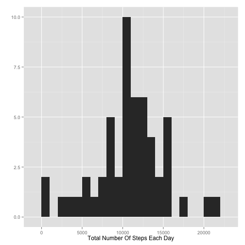
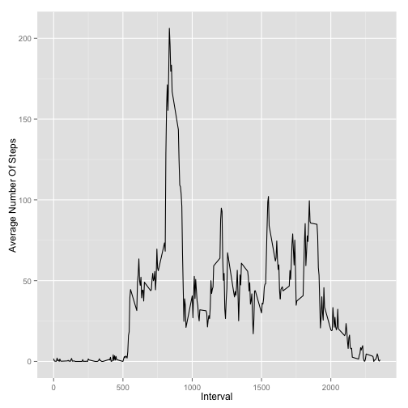
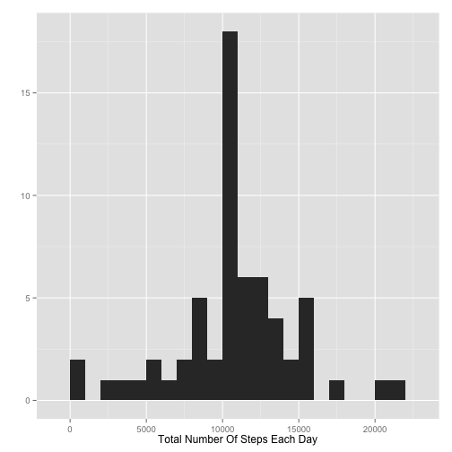

# Reproducible Research: Peer Assessment 1


## Loading and preprocessing the data
Assuming the raw data has been unzipped in the current working directory, load
the data into R using read.csv() and setting colClasses to define the type of 
each variable while loading.

```r
activity <- read.csv("./activity.csv", colClasses = c("numeric", "Date", "numeric"))
```


## What is mean total number of steps taken per day?

We can aggregate the number of steps by day using the aggregate() function and
remove NA values. This new data.frame can then be used for plotting and 
computing the mean and median.

```r
activity.byDay <- aggregate(steps ~ date, activity, sum, na.rm = TRUE)
```


Next we plot a histogram of the total number of steps taken each day

```r
library(ggplot2)
qplot(steps, data = activity.byDay, binwidth = 1000, xlab = "Total Number Of Steps Each Day", 
    ylab = "")
```

 


And finally, we can calculate the mean and median of the number of steps taken 
each day.


```r
# scipen option suppresses printing numerics in scientific notation
options(scipen = 10)
steps.mean <- mean(activity.byDay$steps)

steps.median <- median(activity.byDay$steps)
```

**Mean Total Steps Per Day = 10766.1887**

**Median Total Steps Per Day = 10765**

## What is the average daily activity pattern?

Similar to the last problem we can use the aggregate() function to find the 
average steps taken in each time interval and use this new data.frame to plot a 
time series and make calculations.


```r
activity.byInterval <- aggregate(steps ~ interval, activity, mean, na.rm = TRUE)
```


Now we can plot a time series by interval of the average number of steps taken.


```r
library(ggplot2)
qplot(interval, steps, data = activity.byInterval, geom = "line", xlab = "Interval", 
    ylab = "Average Number Of Steps")
```

 


Next we can calculate which interval, on average, contains the max number of 
steps.


```r
maxInterval <- activity.byInterval[activity.byInterval$steps == max(activity.byInterval$steps), 
    ]$interval
```


**The 5-minute interval containing the max number of steps on average is: 835**

## Imputing missing values

First we must calculate the number of rows containing NA values.

```r
activity.na <- sum(is.na(activity))
```


**Number of Rows Containing NA = 2304**

First we will copy the activity data.frame into a new data.frame called activity.filled.
Then we loop through the activity.filled data.frame and replace all NA values with the 
mean value for that interval, averaged over all days, which we calculated in the 
previous section and stored in the activity.byInterval data.frame.


```r
activity.filled <- activity
for (i in 1:nrow(activity.filled)) {
    if (is.na(activity.filled$steps[i])) {
        for (n in 1:nrow(activity.byInterval)) {
            if (activity.byInterval$interval[n] == activity.filled$interval[i]) {
                activity.filled$steps[i] <- round(activity.byInterval$steps[n])
            }
        }
    }
}
```


Repeating what we did in the first section, we will aggregate the total steps
per day and use these numbers from the filled data.frame to plot a histogram
and calculate the mean and median.


```r
activity.filled.byDay <- aggregate(steps ~ date, activity.filled, sum)
```


Next we plot a histogram of the total number of steps taken each day

```r
library(ggplot2)
qplot(steps, data = activity.filled.byDay, binwidth = 1000, xlab = "Total Number Of Steps Each Day", 
    ylab = "")
```

 


And finally, we can calculate the mean and median of the number of steps taken 
each day.


```r
# scipen option suppresses printing numerics in scientific notation
options(scipen = 10)
steps.filled.mean <- mean(activity.filled.byDay$steps)

steps.filled.median <- median(activity.filled.byDay$steps)
```

**Mean Filled Total Steps Per Day = 10765.6393**

**Median Filled Total Steps Per Day = 10762**

**These values do differ from the original calculation and they appear to skew the data quite a bit**

## Are there differences in activity patterns between weekdays and weekends?

Create a new factor variable with two levels(Weekday, Weekend) and add it to the
activity.filled data.frame from the previous step.


```r
activity.filled$weekday[weekdays(activity.filled$date) == "Saturday" | weekdays(activity.filled$date) == 
    "Sunday"] <- "Weekend"
activity.filled$weekday[weekdays(activity.filled$date) == "Monday" | weekdays(activity.filled$date) == 
    "Tuesday" | weekdays(activity.filled$date) == "Wednesday" | weekdays(activity.filled$date) == 
    "Thursday" | weekdays(activity.filled$date) == "Friday"] <- "Weekday"
activity.filled$weekday <- as.factor(activity.filled$weekday)
```


Make a panel plot containing a time series plot of the 5-minute interval (x-axis) and the average number of steps taken, averaged across all weekday days or weekend days.


```r
# First aggregate the data by interval and weekday variables.
activity.byType <- aggregate(steps ~ interval + weekday, activity.filled, mean)
# Lattice Plot
library(lattice)
xyplot(steps ~ interval | weekday, activity.byType, type = "l", grid = TRUE, 
    layout = c(1, 2), xlab = "Interval", ylab = "Average Number Of Steps")
```

 

